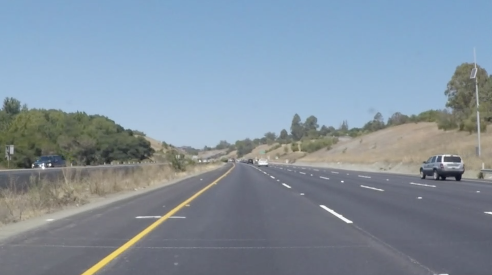

# **Finding Lane Lines on the Road** 

By Seonman Kim (seonman@gmail.com)

---

**Finding Lane Lines on the Road**

The goals / steps of this project are the following:
* Make a pipeline that finds lane lines on the road
* Test with real world data and experience some unexpected problems or issues associated with them, and try to find better solutions.

[//]: # (Image References)

[image1]: ./examples/grayscale.jpg "Grayscale"

---

### Reflection

### 1. Describe your pipeline. As part of the description, explain how you modified the draw_lines() function.

My pipeline consisted of 6 steps. 

1. Convert the images to grayscale
2. Apply Gaussian smoothing filter to make the image blurred. We used a kernel size of 5.
3. Apply Canny Edge detector to the blurred image
4. Set a region of interest by masking the edge image with a quadilateral.
5. Apply Hough transformation to masked image to detect lines from edges, and then draw lines
6. Finally, combine the original image with the line images to show the final output with the detected lines

#### 1. Converting the image to grayscape
There was no issue here.

#### 2. Applying Gaussian filter
I used the kernel size of 5, and there was no issue here.

#### 3. Applying Canny Edge Detector 
Selecting a right pair of low_threahold and high_threshold value was important.
At first, I chose 100 and 200 for low and high threshold, and it seemed working well for the two test videos (solidWhiteRight.mp4 and solidYelloLeft.mp4), but it didn't work well with the challenge image (challenge.mp4), because the video contained some images with brighter color of road (looks like concrete road, as shown below) and the Canny could not extract edges from the part.

So, after several trials, I decided to use the thresholds of 30 and 90 for low and high threshold, and it worked well for all the test and challenge videos.


#### 4. Setting a region of interest
Setting a right region of interest for masking was very important, because there were quite a few line candidates from the edige image. Some edges representing guard wall or the lines of other lanes can be candidate of the line we are looking for. 

I used a trapezoid shape of quadilateral to set a region of interest as shown below. I think it is reasonable under the condition that the car is mostly moving in the center of the lane, and the camera is always fixed in the same location. 

Because the size of input image were different (e.g. the test videos have the resolution of 960x540, but the challenge video has 1280x720), I set the position of the quadlilateral using the width and height of the image with coefficients. This setting should be changed when a camera position is changed.

<p>

<center><em>Setting a region of interest.</em></center>
</p>

#### 5. Applying Hough Transformation and draw line
After several trials with parameters for Hough transformation, I found a set of paremters that works pretty with for all the test and challenge videos. I used rho of 2, threshold of 60,  min_line_length of 30, and max_line_gap of 60.

A more tricky part was drawing lines.
I had to find a single line for each side of left and right. And to make each single line represent fully the lane line, I had to extrapolate each of them.

The following is the procedure to find a line for each side.

1. Compute the value of the slope of a line, e.g. ((y2-y1)/(x2-x1)).
2. If the absolute value of the slope is less than 0.5, we discard the line, because there is no possibility that the line can be a lane line. To be a lane line, a line should have a slope of between 0.5 to 2. (We didn't apply the cutoff with slope more than 2.)
    - Filtering out the lines with the slope was useful. With this, some horizontal edge line like of car bonnet or unexpected line on the road, as shown below, are easily filtered out.
3. Make a pairs of arrays of x and y values of lines with positive slope, which will construct the line on the right side.
4. Make a pair of arrays of x and y values of lines with negative slope, which will construct the line on the left side.
5. Apply the pairs of x and y arrays to `extrapolate_line()` to construct a extrapolted line starting from the bottom of the image.
    - `extrapolate_line()` uses `np.polyfit()` function to find the M (slope) and B (bias) value.
    - And with the Y values of the maximum and of bottom of the image, we can find the end points of the line.

Note that there are some cases that there was no line detected for one side. In this case, we could not find the line, and we just skip drawing the line.

<p>
 
<center><em>Image with car bonnet at the bottom.</em></center>
</p>

<p>
 
<center><em>A horizontal line on the road.</em></center>
</p>

#### 6. Combining the original image with the line images 
There was no issue here.


### 2. Identify potential shortcomings with your current pipeline

- Setting the region of interest and masking the image is highly replying on the location of the car and the position of the camera in the car.
    - If the car is changing the lane or is not located in the center of the lane, then the region setting would not be working properly.
    - So the region should be set dynamically and according based on the car and camera location.

- The edge detection is very critical. Setting the proper thresholds for edge detector was not easy. And it can affect significantly the situation that the car is moving on the road where the brightness and color of the road is dynamically changing. So, these threshold parameters may need to changed accordingly depending on the environment.


### 3. Suggest possible improvements to your pipeline

- As mentioned, setting the region of interest is critical to find the lines. If there are other sensors (motion or gyro, etc.) or cameras that can detect the movement of the car, then we can set the region more accurately.
- The brightness of the image affect a lot on edge detection. We need a way of dynamically setting the threashold parameters for edge detection depending on the road environment.


```python

```
