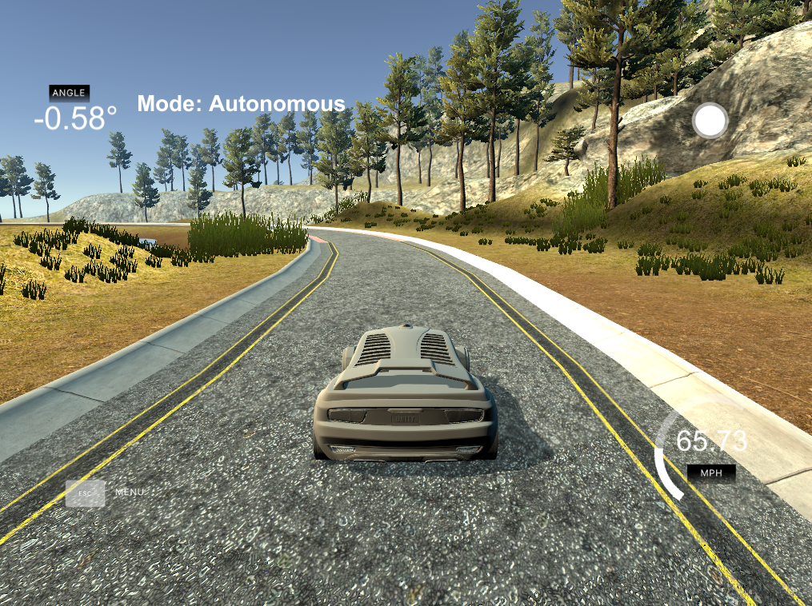

# Project - CarND-Controls-PID Writeup

---

## Implementation

### The PID procedure follows what was taught in the lessons.

The PID implementation is done on the ./src/PID.cpp. The PID::UpdateError method calculates proportional, integral and derivative errors and the PID::TotalError calculates the total error using the appropriate coefficients.

We used two PID controls - one for steer values, the other for throttle values. In the onMessage event handler, the steer and the throttle values are updated by the proportional, integral and differential errors.

## Reflection

### Describe the effect each of the P, I, D components had in your implementation.

The proportional portion of the controller tries to steer the car toward the center line (against the cross-track error). If used along, the car overshoots the central line very easily and go out of the road very quickly.

The integral portion tries to eliminate a possible bias on the controlled system that could prevent the error to be eliminated. If used along, it makes the car to go in circles. In the case of the simulator, no bias is present.

The differential portion helps to counteract the proportional trend to overshoot the center line by smoothing the approach to it.

### Describe how the final hyperparameters were chosen.

The parameters were chosen manually by try and error. First, make sure the car can drive straight with zero as parameters. Then add the proportional and the car start going on following the road but it starts overshooting go out of it. Then add the differential to try to overcome the overshooting. The integral part only moved the car out of the road; so, it stayed as zero. After the car drove the track without going out of it, the parameters increased to minimize the average cross-track error on a single track lap. The final parameters where [P: 1.5, I: 0.0, D: 3.0].

We also used a PID control for throttle value. Thanks to the PID control, the maximum speed reached to around 66 MPH. The throttle value is updated by the total throttle error computed similarly by the proportional, integral and differential errors, but the default value of 0.7 was used as below:

```c++
// Adjust throttle value
pid_throttle.UpdateError(fabs(cte));
throttle_value = 0.7 - pid_throttle.Kp * pid_throttle.p_error -
    pid_throttle.Kd * pid_throttle.d_error -
    pid_throttle.Ki * pid_throttle.i_error;
```

## Simulation

### The vehicle must successfully drive a lap around the track.

A snapshot of the video is:


